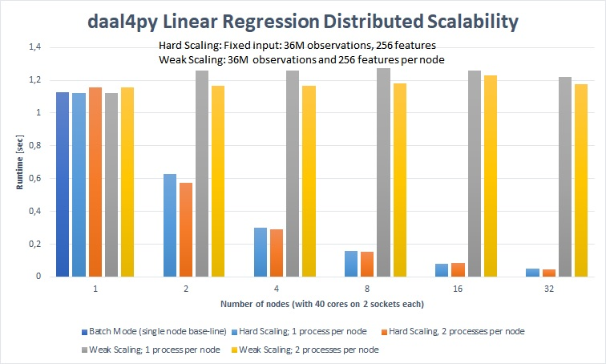
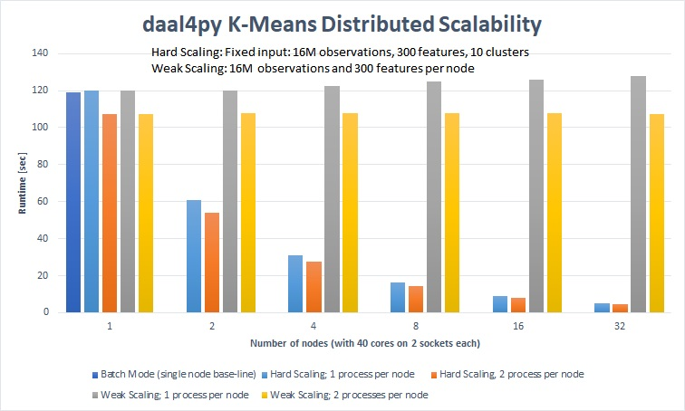

.. Copyright 2020 Intel Corporation
..
.. Licensed under the Apache License, Version 2.0 (the "License");
.. you may not use this file except in compliance with the License.
.. You may obtain a copy of the License at
..
..     http://www.apache.org/licenses/LICENSE-2.0
..
.. Unless required by applicable law or agreed to in writing, software
.. distributed under the License is distributed on an "AS IS" BASIS,
.. WITHOUT WARRANTIES OR CONDITIONS OF ANY KIND, either express or implied.
.. See the License for the specific language governing permissions and
.. limitations under the License.

.. _index:

#####################################################
Fast, Scalable and Easy Machine Learning With DAAL4PY
#####################################################

.. include:: note.rst

Daal4py makes your Machine Learning algorithms in Python lightning fast and easy to use. It provides
highly configurable Machine Learning kernels, some of which support streaming input data and/or can
be easily and efficiently scaled out to clusters of workstations.  Internally it uses Intel(R)
oneAPI Data Analytics Library to deliver the best performance.

Designed for Data Scientists and Framework Designers
----------------------------------------------------
daal4py was created to give data scientists the easiest way to utilize Intel(R) oneAPI Data Analytics
Library powerful machine learning building blocks directly in a high-productivity manner. A
simplified API gives high-level abstractions to the user with minimal boilerplate, allowing for
quick to write and easy to maintain code when utilizing Jupyter Notebooks. For scaling capabilities,
daal4py also provides the ability to do distributed machine learning, giving a quick way to scale
out. Its streaming mode provides a flexible mechanism for processing large amounts of data and/or
non-contiguous input data.

For framework designers, daal4py has been fashioned to be built under other frameworks from both an
API and feature perspective.  The machine learning models split the training and inference classes,
allowing the model to be exported and serialized if desired.  This design also gives the flexibility
to work directly with the model and associated primitives, allowing one to customize the behavior of
the model itself. The daal4py package can be built with customized algorithm loadouts, allowing for
a smaller footprint of dependencies when necessary.

API Design and usage
--------------------
As an example of the type of API that would be used in a data science context,
the linear regression workflow is showcased below::

    import daal4py as d4p
    # train, test, and target are Pandas dataframes

    d4p_lm = d4p.linear_regression_training(interceptFlag=True)
    lm_trained = d4p_lm.compute(train, target)

    lm_predictor_component = d4p.linear_regression_prediction()
    result = lm_predictor_component.compute(test, lm_trained.model)

In the example above, it can be seen that model is divided into training and
prediction.  This gives flexibility when writing custom grid searches and custom
functions that modify model behavior or use it as a parameter. Daal4py also
allows for direct usage of NumPy arrays and pandas DataFrames instead of oneDAL
NumericTables, which allow for better integration with the pandas/NumPy/SciPy stack.

Daal4py machine learning algorithms are constructed with a rich set of
parameters. Assuming we want to find the initial set of centroids for kmeans,
we first create an algorithm and configure it for 10 clusters using the 'PlusPlus' method::

    kmi = kmeans_init(10, method="plusPlusDense")

Assuming we have all our data in a CSV file we can now call it::

    result = kmi.compute('data.csv')

Our result will hold the computed centroids in the 'centroids' attribute::

    print(result.centroids)

The full example could look like this::

    from daal4py import kmeans_init
    result = kmeans_init(10, method="plusPlusDense").compute('data.csv')
    print(result.centroids)

One can even :ref:`run this on a cluster <distributed>` by simply
adding initializing/finalizing the network and adding a keyword-parameter::

    from daal4py import daalinit, daalfini, kmeans_init
    daalinit()
    result = kmeans_init(10, method="plusPlusDense", distributed=True).compute(my_file)
    daalfini()

Last but not least, daal4py allows :ref:`getting input data from streams <streaming>`::

    from daal4py import svd
    algo = svd(streaming=True)
    for input in stream_or_filelist:
        algo.compute(input)
    result = algo.finalize()

oneAPI and GPU support in daal4py
---------------------------------
daal4py oneAPI and GPU support is deprecated. Use `scikit-learn-intelex <https://uxlfoundation.github.io/scikit-learn-intelex/latest/oneapi-gpu.html#>`_
instead.

Daal4py's Design
----------------
The design of daal4py utilizes several different technologies to deliver Intel(R) oneAPI Data
Analytics Library performance in a flexible design to Data Scientists and Framework designers. The
package uses Jinja templates to generate Cython-wrapped oneDAL C++ headers, with Cython as a bridge
between the generated oneDAL code and the Python layer. This design allows for quicker development
cycles and acts as a reference design to those looking to tailor their build of daal4py. Cython
also allows for good Python behavior, both for compatibility to different frameworks and for
pickling and serialization.

Built for Performance
---------------------
Besides superior (e.g. close to native C++ Intel(R) oneAPI Data Analytics Library) performance on a
single node, the distribution mechanics of daal4py provides excellent strong and weak scaling. It
nicely handles distributing a fixed input size on increasing clusters sizes (strong scaling: orange)
which addresses possible response time requirements. It also scales with growing input size (weak
scaling: yellow) which is needed if the data no longer fits into memory of a single node.

	    On a 32-node cluster (1280 cores) daal4py computed linear regression
	    of 2.15 TB of data in 1.18 seconds and 68.66 GB of data in less than
	    48 milliseconds.

	    On a 32-node cluster (1280 cores) daal4py computed K-Means (10
	    clusters) of 1.12 TB of data in 107.4 seconds and 35.76 GB of data
	    in 4.8 seconds.

Configuration: Intel(R) Xeon(R) Gold 6148 CPU @ 2.40GHz, EIST/Turbo on 2
sockets, 20 cores per socket, 192 GB RAM, 16 nodes connected with Infiniband,
Oracle Linux Server release 7.4, using 64-bit floating point numbers

Getting daal4py
---------------
daal4py is available at the `Python Package Index <https://pypi.org/project/daal4py/>`_,
on Anaconda Cloud in `Conda Forge channel <https://anaconda.org/conda-forge/daal4py>`_
and in `Intel channel <https://anaconda.org/intel/daal4py>`_.
Sources and build instructions are available in
`daal4py repository <https://github.com/uxlfoundation/scikit-learn-intelex/tree/main/daal4py>`_.

The daal4py package is available via same distribution channels and platforms as scikit-learn-intelex.
See
`scikit-learn-intelex requirements <https://uxlfoundation.github.io/scikit-learn-intelex/latest/system-requirements.html>` _

- Install from PyPI::

     pip install daal4py

- Install from Anaconda Cloud: Conda-Forge channel::

     сonda install daal4py -c conda-forge

- Install using conda from the Intel repository::

    conda install daal4py -c https://software.repos.intel.com/python/conda/

We recommend to use **PyPi**. If you are using Intel® Distribution for Python,
we recommend using **conda from the Intel Repository**.
In other cases, use **Anaconda Cloud: conda-forge channel**.

Overview
--------
All algorithms in daal4py work the same way:

1. Instantiate and parameterize
2. Run/compute on input data

The below tables list the accepted arguments. Those with no default (None) are
required arguments. All other arguments with defaults are optional and can be
provided as keyword arguments (like ``optarg=77``).  Each algorithm returns a
class-like object with properties as its result.

For algorithms with training and prediction, simply extract the ``model``
property from the result returned by the training and pass it in as the (second)
input argument.

Note that all input objects and the result/model properties are native types,
e.g. standard types (integer, float, Numpy arrays, Pandas DataFrames,
...). Additionally, if you provide the name of a csv-file as an input argument
daal4py will work on the entire file content.

Scikit-Learn API and patching
-----------------------------
.. tip::
    We recommend using
    the 'scikit-learn-intelex package patching <https://uxlfoundation.github.io/scikit-learn-intelex/latest/what-is-patching.html>' _ for the scikit-learn patching.
daal4py exposes some oneDAL solvers using a scikit-learn compatible API.

daal4py can furthermore monkey-patch the ``sklearn`` package to use the DAAL
solvers as drop-in replacement without any code change.

Please refer to the section on :ref:`scikit-learn API and patching <sklearn>`
for more details.
