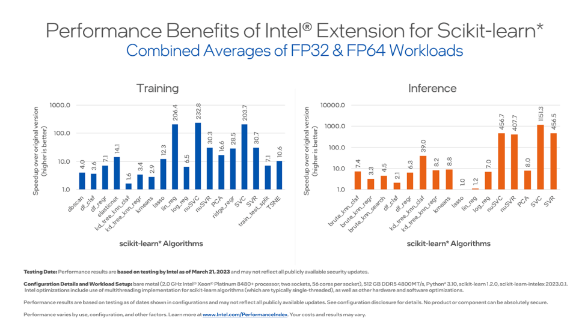

.. ******************************************************************************
.. * Copyright 2021 Intel Corporation
.. *
.. * Licensed under the Apache License, Version 2.0 (the "License");
.. * you may not use this file except in compliance with the License.
.. * You may obtain a copy of the License at
.. *
.. *     http://www.apache.org/licenses/LICENSE-2.0
.. *
.. * Unless required by applicable law or agreed to in writing, software
.. * distributed under the License is distributed on an "AS IS" BASIS,
.. * WITHOUT WARRANTIES OR CONDITIONS OF ANY KIND, either express or implied.
.. * See the License for the specific language governing permissions and
.. * limitations under the License.
.. *******************************************************************************/

##############
Acceleration
##############

The software acceleration provided by |intelex| is achieved through the use of vector instructions,
IA hardware-specific memory optimizations, threading, and optimizations for all upcoming Intel platforms at launch time.

|intelex| dynamically patches scikit-learn estimators to use Intel(R) oneAPI Data Analytics Library
as the underlying solver, while getting the same solution faster.

|intelex| depends on daal4py. You can learn more in `daal4py documentation <https://intelpython.github.io/daal4py>`_.

Speedup over original Scikit-learn
----------------------------------

Configurations:

- HW: c5.24xlarge AWS EC2 Instance using an Intel Xeon Platinum 8275CL with 2 sockets and 24 cores per socket
- SW: scikit-learn version 0.24.2, scikit-learn-intelex version 2021.2.3, Python 3.8

.. Tip:: You can also try out the benchmarks used to create this data by going to Intel’s `scikit-learn_bench <https://github.com/IntelPython/scikit-learn_bench>`_ repository and following the relevant instructions.

Kaggle Kernels
**************

Check out `Introduction to scikit-learn-intelex
<https://www.kaggle.com/code/lordozvlad/introduction-to-scikit-learn-intelex/notebook>`_,
a Kaggle notebook that summarizes the speedup you can achieve with |intelex|.

The acceleration is measured for a variety of machine learning workflows and Kaggle datasets.