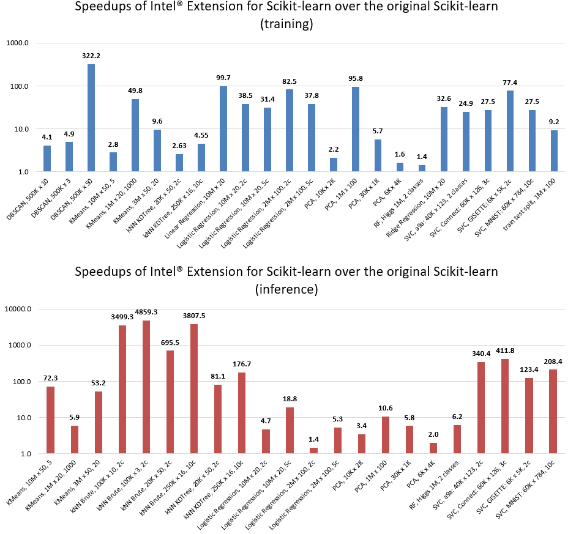

.. ******************************************************************************
.. * Copyright 2020-2021 Intel Corporation
.. *
.. * Licensed under the Apache License, Version 2.0 (the "License");
.. * you may not use this file except in compliance with the License.
.. * You may obtain a copy of the License at
.. *
.. *     http://www.apache.org/licenses/LICENSE-2.0
.. *
.. * Unless required by applicable law or agreed to in writing, software
.. * distributed under the License is distributed on an "AS IS" BASIS,
.. * WITHOUT WARRANTIES OR CONDITIONS OF ANY KIND, either express or implied.
.. * See the License for the specific language governing permissions and
.. * limitations under the License.
.. *******************************************************************************/

.. _index:

#####################################################
Intel(R) Extension for Scikit-learn*
#####################################################
Intel(R) Extension for Scikit-learn is a seamless way to speed up your Scikit-learn application. 
The acceleration is achieved through the use of the Intel(R) oneAPI Data Analytics Library
(`oneDAL <https://github.com/oneapi-src/oneDAL>`_). Patching scikit-learn makes it a
well-suited machine learning framework for dealing with real-life problems.

Configurations:

- HW: c5.24xlarge AWS EC2 Instance using an Intel Xeon Platinum 8275CL with 2 sockets and 24 cores per socket
- SW: scikit-learn version 0.24.2, scikit-learn-intelex version 2021.2.3, Python 3.8

Designed for Data Scientists and Framework Designers
----------------------------------------------------
Intel(R) Extension for Scikit-learn* was created to give data scientists the easiest way to get a better performance
while using the familiar scikit-learn package.

Intel(R) Extension for Scikit-learn* depends on Intel(R) daal4py. You can learn more in `daal4py documentation <https://intelpython.github.io/daal4py>`_.

Usage
--------------------
Intel(R) Extension for Scikit-learn* dynamically patches scikit-learn estimators to use Intel(R) oneAPI Data Analytics Library
as the underlying solver, while getting the same solution faster.

- It is possible to enable those patches without editing the code of a scikit-learn application by
  using the following commandline flag::

    python -m sklearnex my_application.py

- Or from your script::

    from sklearnex import patch_sklearn
    patch_sklearn()

For example::

    import numpy as np
    from sklearnex import patch_sklearn
    patch_sklearn()

    # Need to re-import sklearn algorithms after the patch
    from sklearn.cluster import KMeans

    X = np.array([[1,  2], [1,  4], [1,  0],
                  [10, 2], [10, 4], [10, 0]])
    kmeans = KMeans(n_clusters=2, random_state=0).fit(X)
    print(f"kmeans.labels_ = {kmeans.labels_}")

In the example above, you can see that the use of the original Scikit-learn
has not changed. This behavior is achieved through drop-in patching.

To undo the patch, run::

    sklearnex.unpatch_sklearn()
    # You need to re-import scikit-learn algorithms after the unpatch:
    from sklearn.cluster import KMeans

You may specify which algorithms to patch:

- Patching only one algorithm::

    from sklearnex import patch_sklearn
    # The names match scikit-learn estimators
    patch_sklearn("SVC")

- Patching several algorithms::

    from sklearnex import patch_sklearn
    # The names match scikit-learn estimators
    patch_sklearn(["SVC", "DBSCAN"])

Intel(R) Extension for Scikit-learn does not patch all scikit-learn algorithms and parameters.
You can find the :ref:`full patching map here <sklearn_algorithms>`.

.. note::
    Intel(R) Extension for Scikit-learn supports optimizations for the last four versions of scikit-learn.
    The latest release of scikit-learn-intelex-2021.3.X supports scikit-learn 0.22.X, 0.23.X, 0.24.X and 1.0.X.

Follow us on Medium
--------------------
We publish blogs on Medium, so `follow us <https://medium.com/intel-analytics-software/tagged/machine-learning>`_
to learn tips and tricks for more efficient data analysis the help of Intel(R) Extension for Scikit-learn.
Here are our latest blogs:

- `Superior Machine Learning Performance on the Latest Intel Xeon Scalable Processors <https://medium.com/intel-analytics-software/superior-machine-learning-performance-on-the-latest-intel-xeon-scalable-processor-efdec279f5a3>`_,
- `Leverage Intel Optimizations in Scikit-Learn <https://medium.com/intel-analytics-software/leverage-intel-optimizations-in-scikit-learn-f562cb9d5544>`_,
- `Intel Gives Scikit-Learn the Performance Boost Data Scientists Need <https://medium.com/intel-analytics-software/intel-gives-scikit-learn-the-performance-boost-data-scientists-need-42eb47c80b18>`_,
- `From Hours to Minutes: 600x Faster SVM <https://medium.com/intel-analytics-software/from-hours-to-minutes-600x-faster-svm-647f904c31ae>`_,
- `Improve the Performance of XGBoost and LightGBM Inference <https://medium.com/intel-analytics-software/improving-the-performance-of-xgboost-and-lightgbm-inference-3b542c03447e>`_,
- `Accelerate Kaggle Challenges Using Intel AI Analytics Toolkit <https://medium.com/intel-analytics-software/accelerate-kaggle-challenges-using-intel-ai-analytics-toolkit-beb148f66d5a>`_,
- `Accelerate Your scikit-learn Applications <https://medium.com/intel-analytics-software/improving-the-performance-of-xgboost-and-lightgbm-inference-3b542c03447e>`_,
- `Accelerate Linear Models for Machine Learning <https://medium.com/intel-analytics-software/accelerating-linear-models-for-machine-learning-5a75ff50a0fe>`_,
- `Accelerate K-Means Clustering <https://medium.com/intel-analytics-software/accelerate-k-means-clustering-6385088788a1>`_.

Important links
--------------------
- `GitHub <https://github.com/intel/scikit-learn-intelex>`_
- `Benchmark code <https://github.com/IntelPython/scikit-learn_bench>`_
- `Building from Sources <https://github.com/intel/scikit-learn-intelex/blob/master/INSTALL.md>`_
- `About Intel(R) oneAPI Data Analytics Library <https://github.com/oneapi-src/oneDAL>`_
- `About Intel(R) daal4py <https://github.com/intel/scikit-learn-intelex/tree/master/daal4py>`_

Support
--------------------
Report issues, ask questions, and provide suggestions using:

- `GitHub Issues <https://github.com/intel/scikit-learn-intelex/issues>`_,
- `GitHub Discussions <https://github.com/intel/scikit-learn-intelex/discussions>`_,
- `Forum <https://community.intel.com/t5/Intel-Distribution-for-Python/bd-p/distribution-python>`_.

You may reach out to project maintainers privately at onedal.maintainers@intel.com
