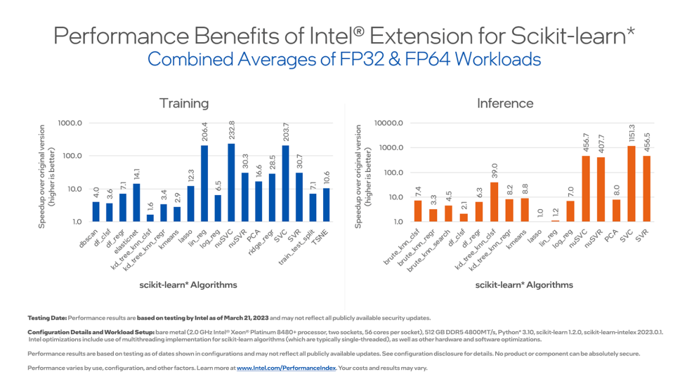

.. ******************************************************************************
.. * Copyright 2020 Intel Corporation
.. *
.. * Licensed under the Apache License, Version 2.0 (the "License");
.. * you may not use this file except in compliance with the License.
.. * You may obtain a copy of the License at
.. *
.. *     http://www.apache.org/licenses/LICENSE-2.0
.. *
.. * Unless required by applicable law or agreed to in writing, software
.. * distributed under the License is distributed on an "AS IS" BASIS,
.. * WITHOUT WARRANTIES OR CONDITIONS OF ANY KIND, either express or implied.
.. * See the License for the specific language governing permissions and
.. * limitations under the License.
.. *******************************************************************************/

.. |intelex_repo| replace:: |intelex| repository
.. _intelex_repo: https://github.com/intel/scikit-learn-intelex

.. _index:

#########
|intelex|
#########

Intel(R) Extension for Scikit-learn is a **free software AI accelerator** designed to deliver up to **100X** faster performance for your existing scikit-learn code.
The software acceleration is achieved with vector instructions, AI hardware-specific memory optimizations, threading, and optimizations for all upcoming Intel(R) platforms at launch time.

.. rubric:: Designed for Data Scientists and Framework Designers

Use Intel(R) Extension for Scikit-learn, to:

* Speed up training and inference by up to 100x with the equivalent mathematical accuracy
* Benefit from performance improvements across different x86-compatible CPUs or Intel(R) GPUs
* Integrate the extension into your existing Scikit-learn applications without code modifications
* Enable and disable the extension with a couple of lines of code or at the command line

Intel(R) Extension for Scikit-learn is also a part of `Intel(R) AI Tools <https://www.intel.com/content/www/us/en/developer/tools/oneapi/ai-analytics-toolkit.html>`_.

These performance charts use benchmarks that you can find in the `scikit-learn bench repository <https://github.com/IntelPython/scikit-learn_bench>`_. 

Supported Algorithms 
---------------------

See all of the :ref:`sklearn_algorithms`. 

Intel(R) Optimizations
----------------------------------

Enable Intel(R) CPU Optimizations
*********************************

::

   import numpy as np
   from sklearnex import patch_sklearn
   patch_sklearn()

   from sklearn.cluster import DBSCAN

   X = np.array([[1., 2.], [2., 2.], [2., 3.],
               [8., 7.], [8., 8.], [25., 80.]], dtype=np.float32)
   clustering = DBSCAN(eps=3, min_samples=2).fit(X)

Enable Intel(R) GPU optimizations
*********************************
::

   import numpy as np
   import dpctl
   from sklearnex import patch_sklearn, config_context
   patch_sklearn()

   from sklearn.cluster import DBSCAN

   X = np.array([[1., 2.], [2., 2.], [2., 3.],
               [8., 7.], [8., 8.], [25., 80.]], dtype=np.float32)
   with config_context(target_offload="gpu:0"):
       clustering = DBSCAN(eps=3, min_samples=2).fit(X)

.. toctree::
   :caption: Get Started
   :hidden:
   :maxdepth: 3

   quick-start.rst
   samples.rst
   kaggle.rst
   
.. toctree::
   :caption: Developer Guide
   :hidden:
   :maxdepth: 2

   algorithms.rst
   oneAPI and GPU support <oneapi-gpu.rst>
   distributed-mode.rst
   verbose.rst
   deprecation.rst
   

.. toctree::
   :caption: Performance
   :hidden:
   :maxdepth: 2

   guide/acceleration.rst

.. toctree::
   :caption: Learn 
   :hidden:
   :maxdepth: 2

   Tutorials & Case Studies <tutorials.rst>
   Medium Blogs <blogs.rst>

.. toctree::
   :caption: More
   :hidden:
   :maxdepth: 2
   
   Support <support.rst>
   contribute.rst
   license.rst
